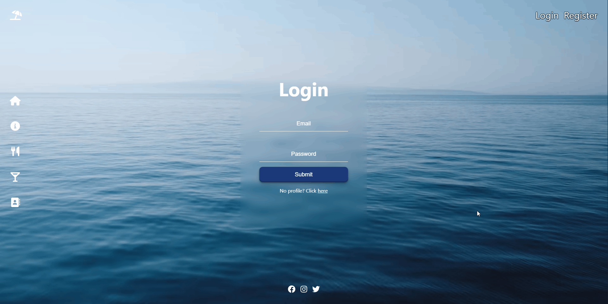
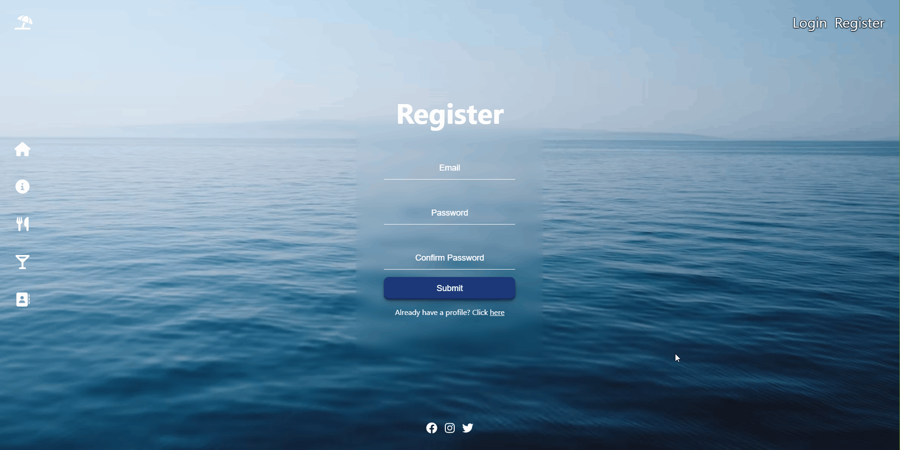

## Available Scripts

In the project directory, you can run:

### `npm start`

Runs the app in the development mode.\
Open [http://localhost:3000](http://localhost:3000) to view it in your browser.

## Additional modules

### **Font Awesome Icons**
```
npm install --save @fortawesome/fontawesome-svg-core
npm install --save @fortawesome/free-regular-svg-icons
npm install --save @fortawesome/free-solid-svg-icons
npm install --save @fortawesome/react-fontawesome
```

## The server I'm using for this project

**https://github.com/softuni-practice-server/softuni-practice-server**

# Home Page


# Login & Register Form Validations






# Reservation Functionality


# Food & Drinks Functionality


